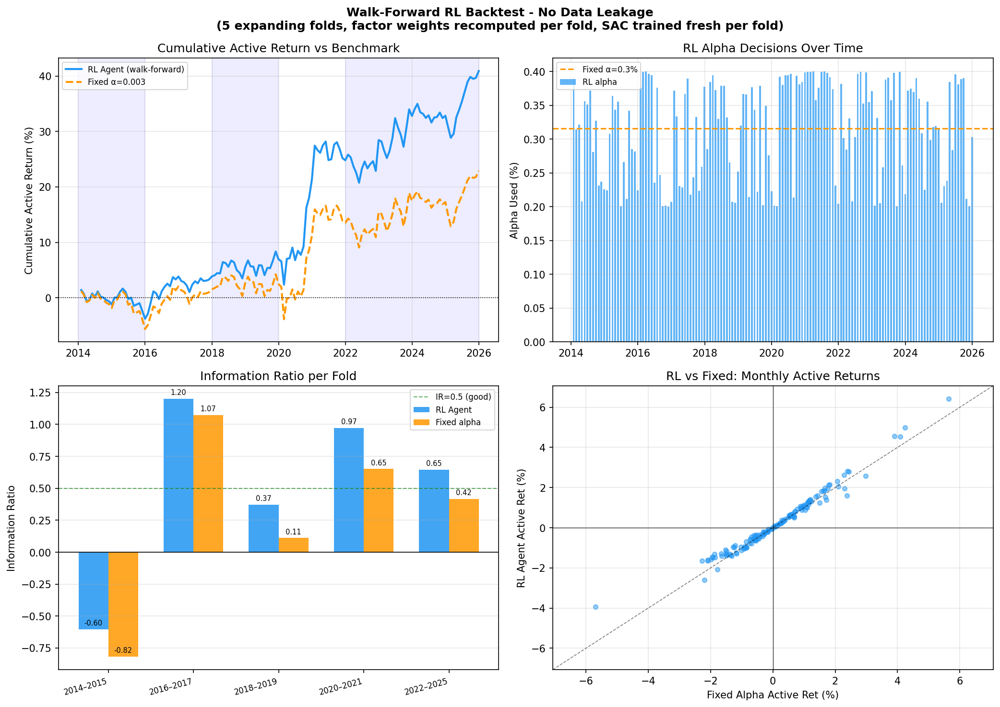
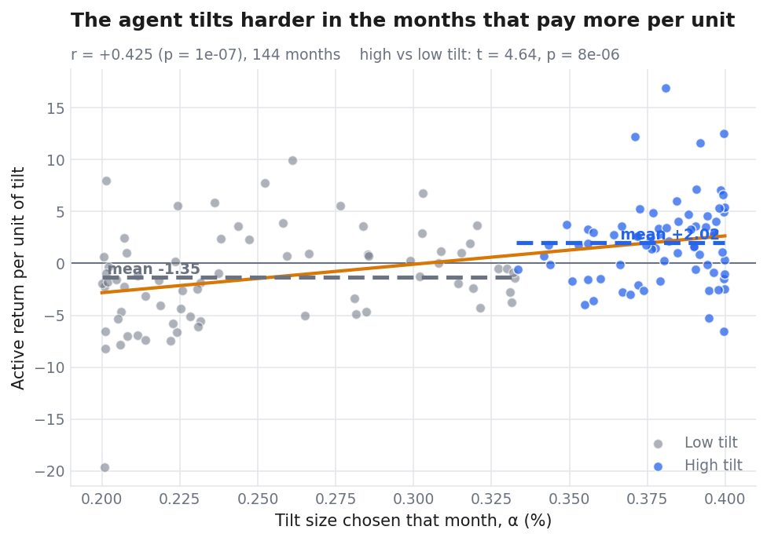
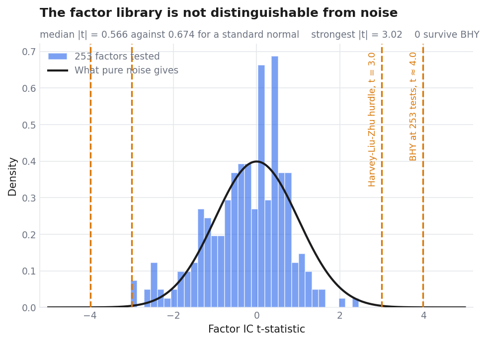

# S&P 500 Index Enhancement

*Patrick Ridge, Kieran Chung*

Hold all 500 index constituents, tilt the weights slightly using a model, and
earn a thin layer of alpha without drifting far from the benchmark. It is a
real product category: AQR, Robeco, Acadian and most bank systematic desks run
some version. The metric is the information ratio, annual alpha divided by
tracking error, and the mandate is usually 2-4% tracking error.

This repo asks two questions. Can a cross-sectional transformer rank stocks
better than simpler models? Can a reinforcement-learning policy size the tilt
better than a constant?

**Stock selection does not work here. Tilt sizing does.** No ranking model
beats the benchmark over 140 to 152 out-of-sample months, and no factor in a
253-factor library survives multiple-testing correction. The adaptive tilt
policy produces 67% more alpha than a fixed tilt carrying the same risk, and
wins all five walk-forward folds.

An earlier version of this README reported an information ratio of 1.87. It was
wrong, along with two other headline numbers. Finding out why is most of the
real work here, and it is written up in [The audit](#the-audit).

## How it works

1. **Score every stock, every month.** A Cross-Sectional Transformer reads
   ~270 features per stock plus 20 macro series and outputs one score. Two
   attention stages: the first within a stock's own features, the second across
   every stock that month, so each score knows what its peers look like. Macro
   state enters through FiLM conditioning.
2. **Tilt around index weights.** `w = w_index + α × score`, long-only,
   renormalised. The tilt moves every stock by the same number of percentage
   points, so in proportional terms small names move a lot and mega-caps barely
   move. α is one number per month.
3. **Let an agent choose α.** A SAC policy sees signal dispersion, benchmark
   volatility, recent tracking error, a regime flag and yield-curve features,
   then picks α. It is trained on the information ratio directly rather than on
   prediction accuracy.

Steps 1 and 3 are separate problems, and that turns out to matter: one of them
was solvable with this data and the other was not.

## Results

Each model at the α whose tracking error sits closest to the mandate. Net of
10 bps per side. Intervals are 10,000-resample circular block bootstraps with
six-month blocks.

| Model | Months | Alpha | TE | IR | 95% CI |
|---|---|---|---|---|---|
| **RL tilt overlay** | 144 | +2.90% | 5.00% | **+0.579** | **[+0.10, +1.06]** |
| LightGBM | 152 | +0.29% | 2.02% | +0.143 | [−0.36, +0.75] |
| CS-Transformer | 140 | −1.04% | 4.70% | −0.221 | [−0.74, +0.36] |

The overlay is the only row whose interval excludes zero. The two ranking
models have intervals that overlap almost completely, so the data cannot
separate the architectures from each other, let alone from zero. The
transformer's monthly IC is mildly *positive* at +0.0042 while its portfolio IR
is negative, because the z-score tilt sizes positions by score magnitude and
concentrates the bet in the tails of the score distribution.

### The overlay, and the caveat that travels with it

Validation is a 5-fold expanding-window walk-forward, 2014 to 2025. Train on
everything up to a cut-off, trade the next two years blind, step forward,
repeat. Factor weights, state normalisation and the policy are all refit inside
each fold's training slice, so nothing leaks backwards.

| α cap | Alpha | TE | IR | 95% CI | Folds | In mandate? |
|---|---|---|---|---|---|---|
| 1.80% | 6.75% | 9.39% | 0.719 | [+0.24, +1.18] | 5/5 | no |
| 0.40% | 2.90% | 5.00% | 0.579 | [+0.10, +1.06] | 5/5 | no |
| **0.25%** | 1.56% | **4.05%** | 0.386 | [−0.11, +0.90] | **5/5** | **yes** |

**Significance sits at roughly 5% tracking error, just outside a 2-4% mandate.**
Shrink the budget to fit the product and the interval reopens across zero.
Quoting 0.719 without that sentence would repeat the mistake that produced 1.87.

What does not depend on the cap: 5 of 5 folds everywhere tested, and a maximum
active drawdown of −5.78% against −7.77%.

### The baseline has to be the same size

The fixed-α baseline originally ran at 1.0% against an agent averaging 0.32%.
Three times the tilt is three times the tracking error, and since IR falls as α
grows, the smaller tilt wins on arithmetic alone. "Beats fixed in 5 of 5 folds"
was true and empty.

Re-run with the baseline at the agent's own mean tilt, so both carry the same
risk:

| | RL overlay | Fixed, same size |
|---|---|---|
| Annual alpha | **2.90%** | 1.73% |
| Tracking error | 5.00% | 5.04% |
| Information ratio | **0.579** | 0.344 |
| Max active drawdown | **−5.78%** | −7.77% |
| Folds won | **5/5** | — |



**At matched tracking error the agent produces 67% more alpha.** That cannot be
a level effect, because the levels are equal. `ML_FIXED_ALPHA=0.010` reproduces
the old comparison.

### The agent tilts harder when tilting pays

A second test from a different direction. Divide each month's active return by
that month's α. A bigger bet moves the portfolio more whatever the agent knows,
so dividing strips out the mechanical part and leaves the payoff per unit of
tilt. If the policy is adapting rather than drifting, it should tilt hard in the
months that reward it.



High-tilt months pay **+2.02** per unit against **−1.35** for low-tilt months
(Welch t = 4.64, p = 7.8e-6). Across all 144 months α correlates with per-unit
payoff at **r = +0.425**. The agent only ever moves α between 0.20% and 0.40%,
so that is a narrow range producing a wide separation in outcome.

### Which algorithm? It does not matter

| | SAC | PPO | GRPO | DAPO | Fixed |
|---|---|---|---|---|---|
| Mean fold IR | 0.371 | 0.621 | 0.496 | 0.622 | −0.065 |
| Folds won | 5/5 | 5/5 | 3/5 | 4/5 | — |
| Paired p vs fixed | 0.083 | **0.024** | 0.171 | 0.099 | — |

Every pairwise difference is insignificant; PPO and DAPO differ by 0.001 at
p = 0.997. SAC is the one in the headline because it wins every fold and is
off-policy, which matters when you only have 144 months. The value comes from
sizing the tilt at all, not from the choice of policy gradient.

### No factor survives correction



Of 253 factors with computable t-statistics, 15 clear raw p < 0.05 against 12.7
expected by chance, and **none** survives Benjamini-Hochberg-Yekutieli at any
FDR from 0.01 to 0.30. BHY rather than plain BH because factor IC series are
heavily cross-correlated and BH assumes independence, though plain BH also
returns zero until q = 0.30.

**The correction is not what kills them.** The uncorrected numbers already sit
at chance: nothing clears p < 0.001 against 0.25 expected, and median |t| is
0.566 against 0.674 for a standard normal. A library with real factors buried
in noise has a fat tail of small p-values. This one flattens.

Read it narrowly. It does not mean the factors are worthless. It means no
*single* factor is strong enough to clear a bar set for 253 simultaneous tests,
which is the right question for a research claim and the wrong one for whether
a combination is worth trading. What settles the second question here is the
backtest, and it agrees.

**Why it comes out this way** is more interesting than the result. Size and
illiquidity are the two best-documented cross-sectional effects, and the S&P 500
is selected for being large and liquid. A size effect needs small caps to exist.
The library is mostly price and volume derived over a universe that supplies
neither, so four independent models agreeing there is nothing to find is one
consistent answer rather than four separate failures.

Fundamentals and short interest used to be the escape hatch here, declared but
empty, so value and quality had never been *tested* rather than tested and
failed. `1u` and `1v` closed that: EDGAR and FINRA data is now in the library
and reaches |t| 1.49 at best. Institutional ownership is the last group still
empty.

## The audit

Earlier runs reported IR 1.87 for the CS-Transformer, then 1.74, then 1.44 as
bugs were fixed. All of it was spurious, from three compounding problems.

**The tilt formula had drifted from the documented one.** README and docstring
described `w = w_index + α × z`; the code applied a flat ±α to the top and
bottom 100 names. No published number reproduced.

**The benchmark leg was under-invested.** Portfolio weights were renormalised
to sum to 1 and benchmark weights were not. Over the scored universe
`spx_weight` sums to 0.81, because about 19% of index market cap fails the
merge. A fully-invested portfolio measured against an 81%-invested benchmark
books the missing exposure as alpha, worth 3.84%/yr in a rising market.

**Delisted tickers with corrupt prices.** This was the fatal one.
`prices.parquet` keeps names that left the index years ago and `1c` assigns them
a weight anyway. Their weights come out near zero so the benchmark ignores them,
but a score-driven tilt still opens real positions. Compuware, delisted in 2014,
appears in the 2024-25 test window printing +1500%, +900% and +552% in separate
months. Alongside it FNMA and FMCC, OTC since 2008.

One ticker was **63.6%** of top-decile return. Mean monthly decile-10 return was
+5.34% against a median of +0.53%, skew 16.8. Dropping the single best name per
month took it from +86.8% annualised to +4.4%. Dropping two took it negative.

A permutation test had earlier appeared to vindicate the strategy at twelve
standard deviations above a shuffled-score null. It was measuring the wrong
thing: shuffling destroys the model's ability to *locate the zombies*, so the
null collapsed. It proved the selection was non-random, not that it was skilful.

The fix is `clean_universe()` in `config.py`, a minimum index weight of 5e-6
plus a hard gate on monthly returns above 100%, calibrated so every known zombie
goes and the largest survivor falls to +99% (AppLovin, October 2024, real). It
logs what it drops rather than filtering silently.

### Three more faults found the same day

A per-ticker price scale factor. Volume present for only 192 of 697 tickers. An
8% weight cap defeated by the renormalisation that followed it, leaving top-10
concentration at 72% against a real 40%. And `log_mktcap` valid for 9% of rows
from a ticker-format mismatch.

Those killed the other two headline numbers. LightGBM's +0.56 became +0.143, and
17 surviving factors became zero, because "no volume data" had been silently
standing in for "illiquid" and manufacturing a liquidity effect that was not
there.

**One result moved the other way.** The overlay measured IR 0.299 with an
interval spanning zero before the repair. Nothing about the agent changed. Active
return is measured against the benchmark and the benchmark was wrong. This is the
one result the broken data was suppressing rather than inflating.

**Every one of these faults was silent.** Nothing crashed. The numbers just
quietly came out wrong, which is why `0_data_audit.py` exists: 16 invariants
checked against values from outside the repo. Run it before trusting anything.

## Running it

```bash
pip install -r requirements.txt
export SEC_USER_AGENT="Your Name you@mail.com"   # EDGAR 403s without it
```

Build the panel, roughly two hours end to end:

```bash
python 1a_price_parquet.py           # daily OHLCV
python 1b_fetch_constituents.py      # historical membership
python 1c_fetch_market_cap.py        # monthly index weights
python 1g_rebuild_panel.py           # base monthly panel
python 1u_fetch_edgar_fundamentals.py
python 1v_fetch_short_interest.py
python 1h_feature_engineering.py     # ~270 factor columns
python 0_data_audit.py               # do not skip this
```

Then the models and backtests:

```bash
python 3f_lgbm_baseline.py           # LightGBM reference
python 4b_index_enhancement.py       # tilt backtest, α sweep
python 5c_walk_forward.py            # RL overlay, 5-fold
python 8_readme_figures.py           # the figures above
```

The CS-Transformer runs on Kaggle: upload
`data/panel_monthly_enriched.parquet` as a dataset called `investsoc-ml-data`,
set the accelerator to GPU T4, paste `3d_cs_transformer_kaggle.py` into a cell.
About 60-90 minutes including the RL fine-tune. See `KAGGLE.md`.

Both data sources are free and keyless. Each stamps rows with the date a figure
became *public*, not the period it describes: a 10-K lands about 40 days after
quarter end and short interest about 8 days after settlement, so using the
period date hands the model weeks of hindsight.

## Layout

```
config.py                    shared parameters, universe cleaning, paths
utils_factors.py             ~190 factor functions
0_data_audit.py              16 invariants against external values
1a-1v_*.py                   data fetch and feature engineering
2a-2k_*.py                   factor diagnostics, BHY, FDR sensitivity
3a-3f_*.py                   ranking models (FT, CS-Transformer, LightGBM)
4a-4i_*.py                   backtests, portfolio construction, capacity
5a-5h_*.py                   RL overlays and algorithm comparison
8_readme_figures.py          the two figures above that 5c does not make
research/factor_mining/      IS-only candidate discovery
Notes/                       development log
```

## What is not solved

**The benchmark is approximate.** `1c` builds index weights from current shares
outstanding times historical price, which tilts the index toward names that went
on to win. The rebuilt benchmark returns 15.7%/yr over 2010-2024 against a real
S&P 500 near 13.5%. Active return differences out the level, so the information
ratios are largely unaffected, but absolute Sharpe figures and the claim that
tracking error is 2-4% against the S&P 500 *specifically* are both reachable by
this.

**Survivorship bias is estimated, not corrected.** 247 tickers cannot be
refetched without CRSP or Compustat. Index leavers underperform by −4.16%/month
over their final six months, which scales to roughly **+0.50%/yr of spurious
alpha** in every backtest here. Read any alpha as about half a point optimistic.

**The universe is incomplete.** 677 tickers against roughly 1,200 that passed
through the index between 2010 and 2025, and 478-612 names per month rather than
500. Two tickers, `SW` and `TMUS`, stitch two different companies together.

**Capacity is not the binding constraint.** A square-root impact model puts
total cost below 0.65%/yr out to about $10bn. A strategy whose IR interval spans
zero does not have a size problem.

## Next

**Widen the universe past the S&P 500.** Size and illiquidity are the strongest
effects in the library and both are structurally underpowered in large caps.
A Russell 2000 or all-cap panel is the one change that could plausibly move the
factor result, and everything below `1b_fetch_constituents.py` is universe
agnostic.

13F institutional ownership is the last declared-and-empty group, and EDGAR
serves it on the same endpoint pattern `1u` already uses. More OHLCV factor
mining is the weakest option left: 70 mined candidates already underperform the
hand-built factors, and every extra test raises the BHY bar for all of them.
